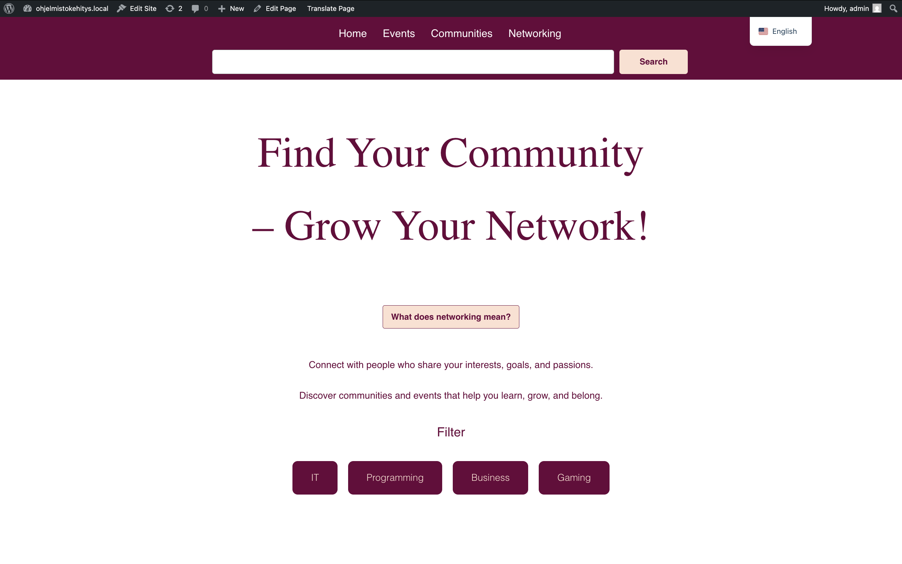
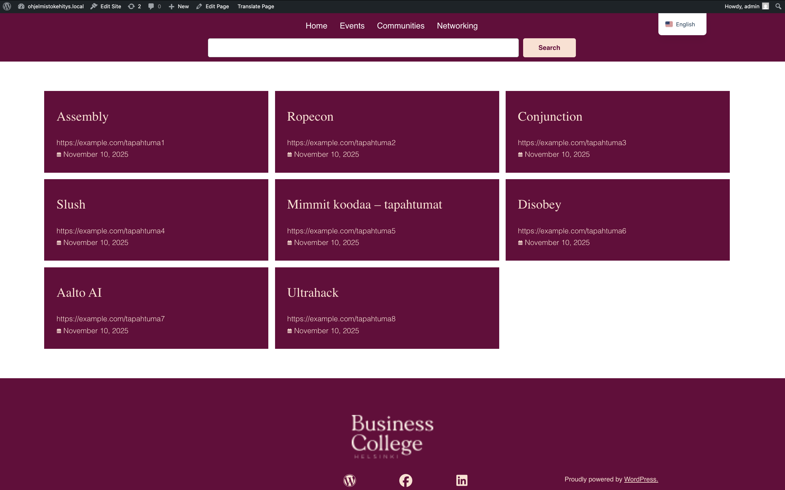
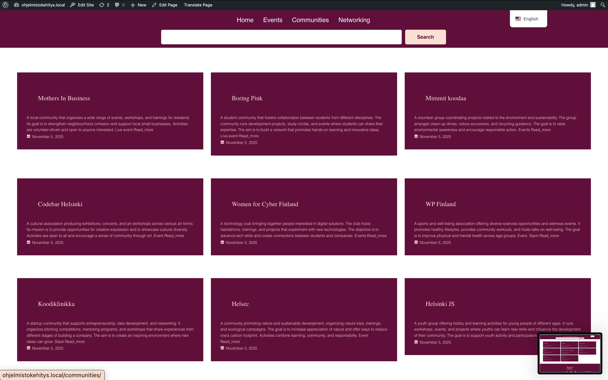
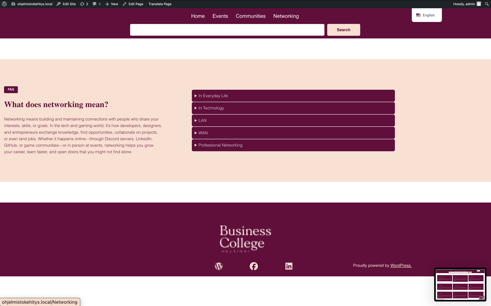
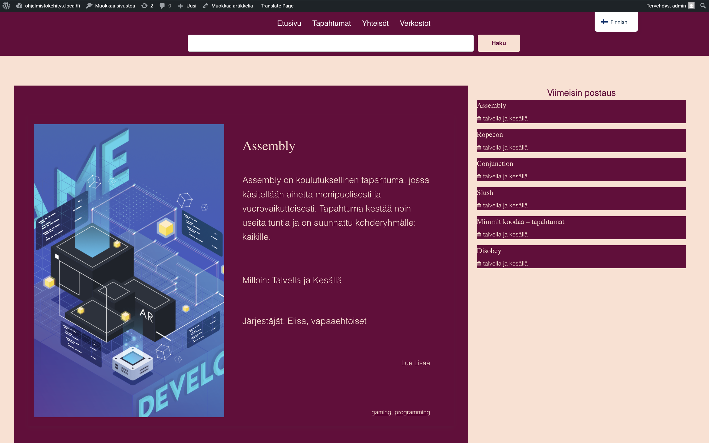
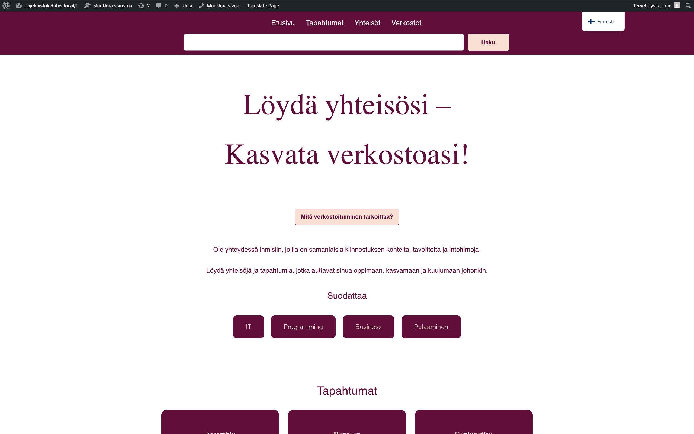
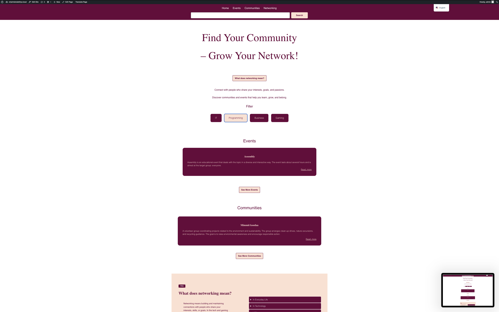
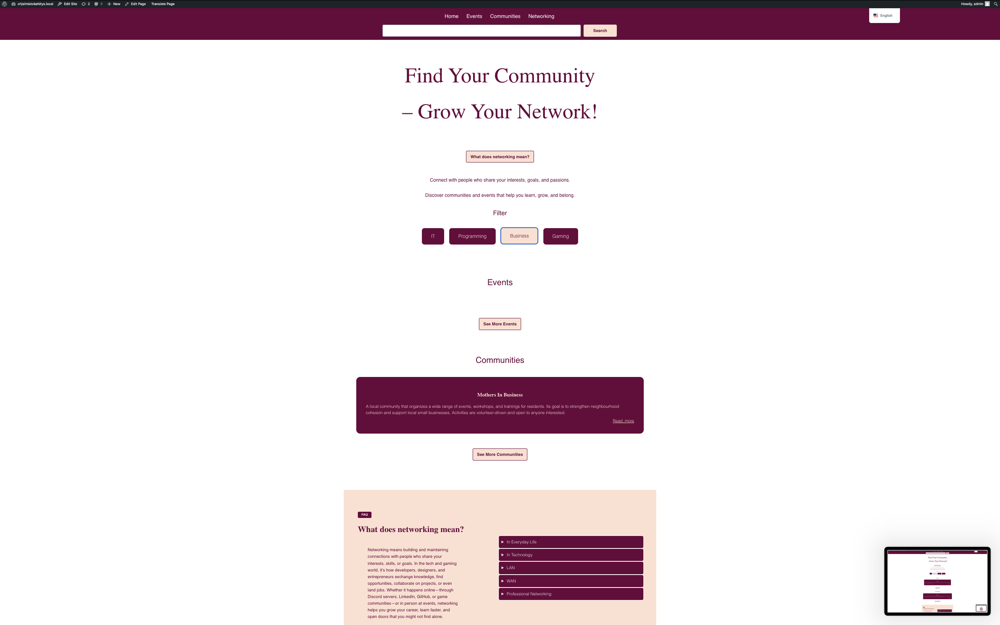
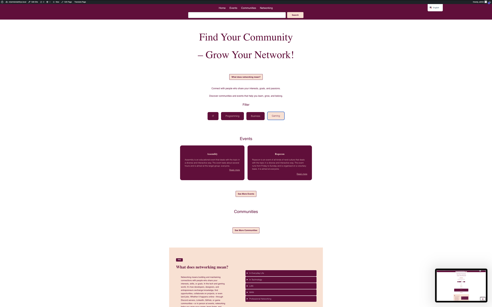

# 🌐 Business College Hekseniki – Networking & Community Platform

**By: Bita Yeganeh**

---

## 📌 Project Overview

This project is a modern, bilingual (English + Finnish) WordPress website created for **Hekseniki Business College**.  
Its purpose is to help students and community members **find networking opportunities**, discover **local communities**, and explore **events** related to IT, business, programming, gaming, and more.

The site highlights how networking connects people with shared interests, encourages collaboration, and supports personal and professional growth.

---

## 🏠 Main Pages

The website includes the following sections:

### **Home Page**

- Title: _Find Your Community – Grow Your Network!_
- Explains the meaning of networking
- Includes filters for event categories (IT, Programming, Business, Gaming, Events)

### **Events Page**

Displays upcoming events with descriptions and "Read more" links:

- **Assembly** – educational, interactive event
- **Ropecon** – community and nerd-culture event
- **Conjunction** – learning-oriented interactive event  
  ....

### **Communities Page**

Showcases local and student communities:

- Mothers in Business
- Boring Pink
- Mimmit Koodaa  
  ....

### **Networking Page**

Contains FAQ explaining networking in different contexts:

- Everyday life
- Technology
- LAN / WAN
- Professional networking

---

## 🌍 Bilingual Support

The website includes **two languages**:

- 🇬🇧 English
- 🇫🇮 Finnish

---

## 🛠️ Tools & Technologies

- **WordPress CMS**
- Custom page structure
- Theme customization
- Navigation bar with links to all main sections
- Multilingual support
- Responsive design elements

---

## ✨ Features

- Clean and simple layout for students and community users
- List of events with category filters
- Community descriptions with more info pages
- Networking explanation and FAQ
- Multilingual UI
- Designed to encourage student engagement and collaboration

---

## 🧑‍💻 Author

**Project completed by:**  
**Bita Yeganeh**

- Designed all pages
- Added bilingual support
- Created layouts for Events, Communities, and Networking pages
- Managed content structure and navigation
- Developed and customized the WordPress setup

## 📸 Screenshots

### Home Page

### Events Page

### Communities Page

### Networking Page

### Finnish Pages

### Filter Pages

